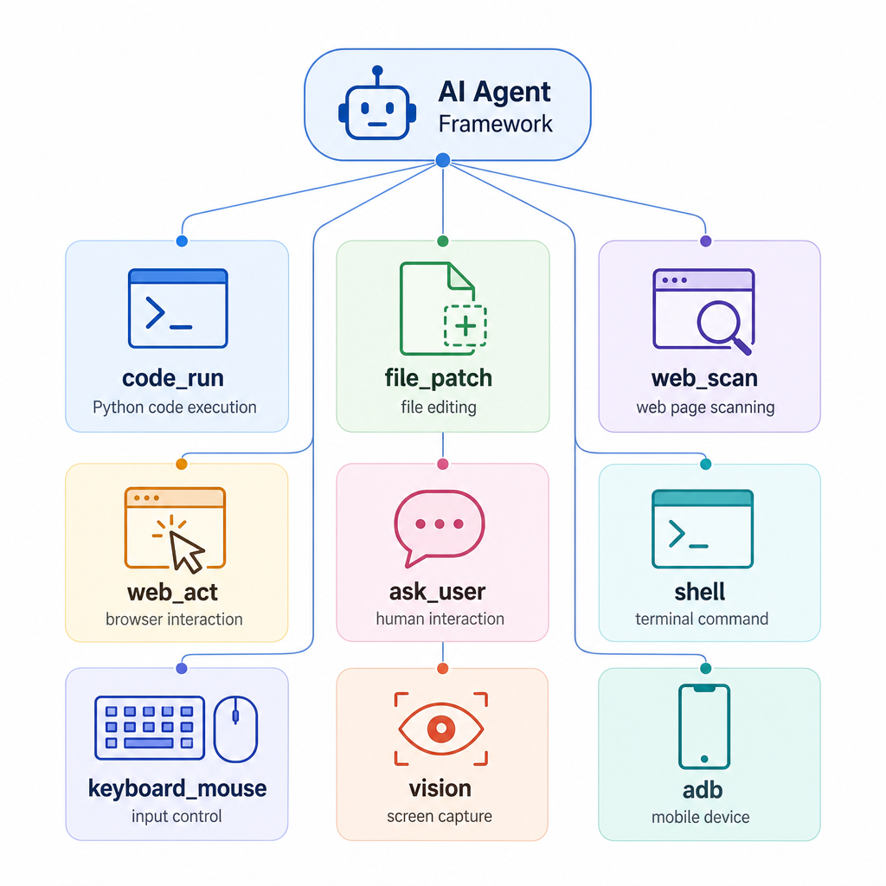
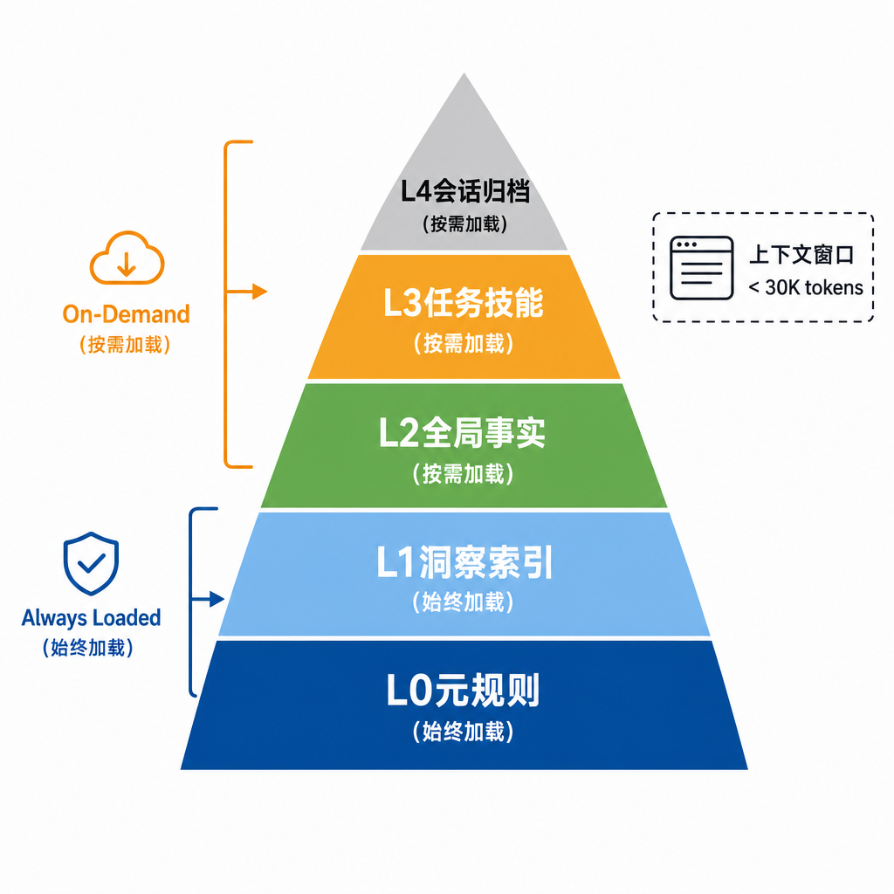
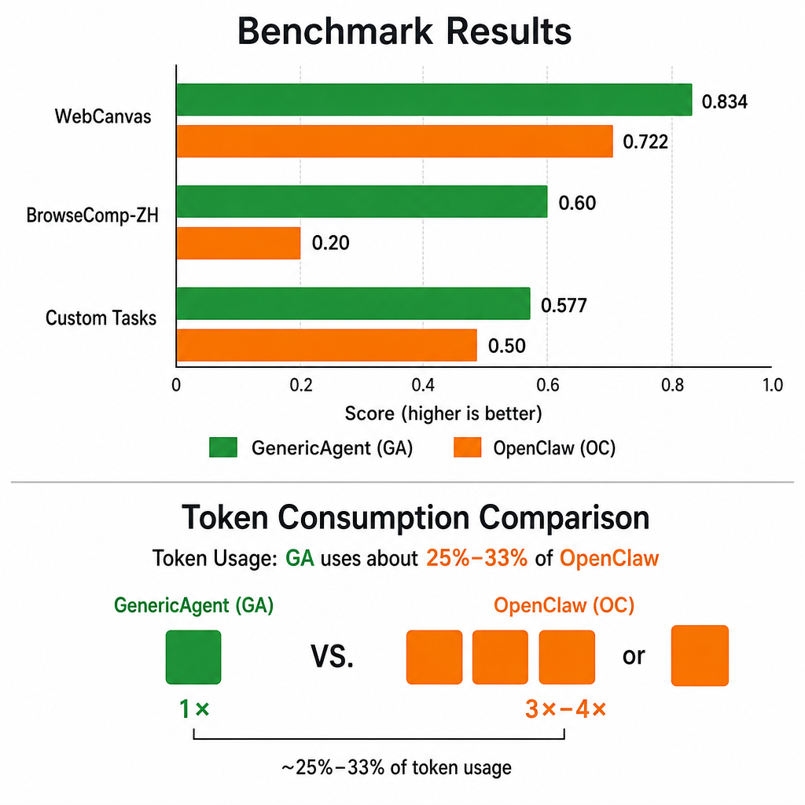
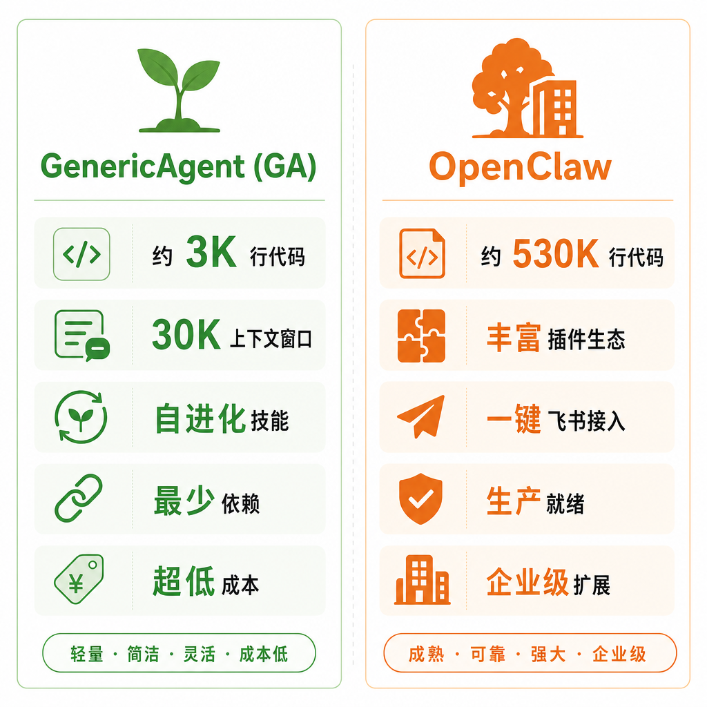
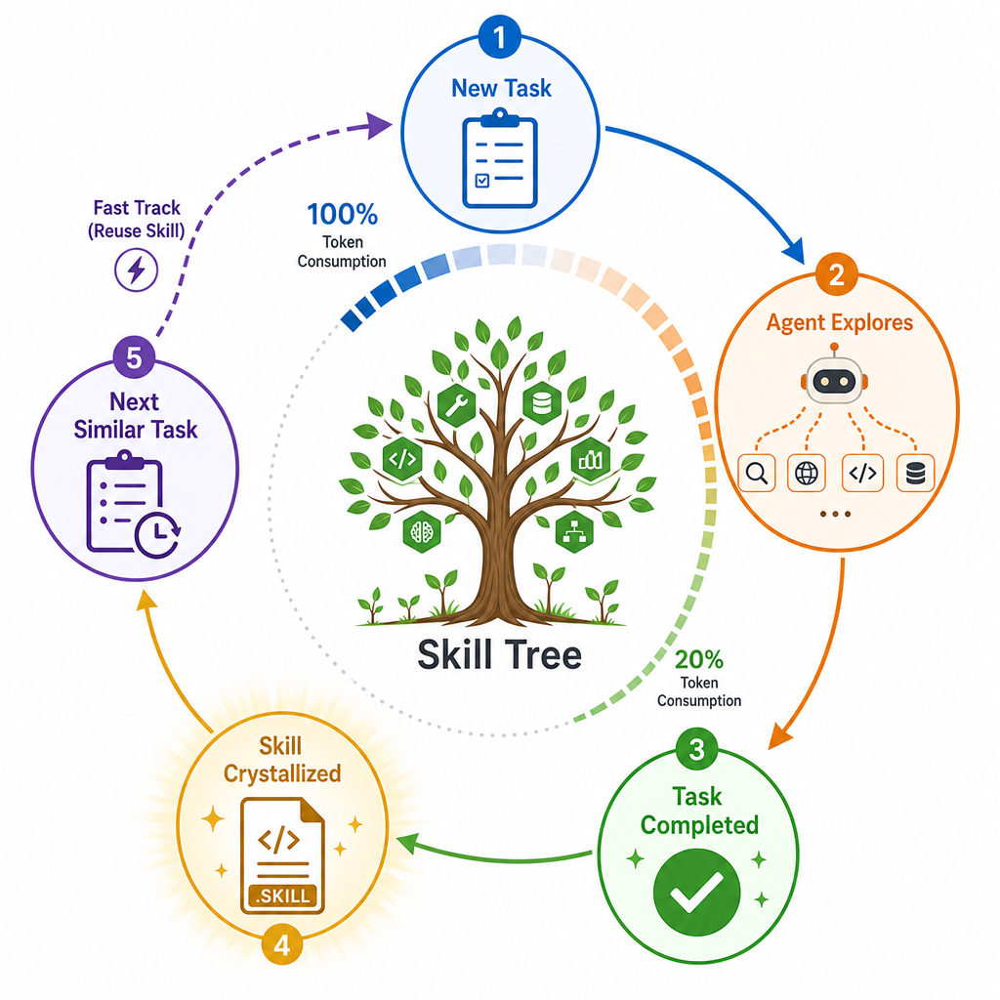

# 我亲手部署了GenericAgent，踩完所有坑，把真实体验摊开给你看

超长预警，这篇文章预计阅读时长 12 分钟。如果你只想看结论，先看这五条：

**1、** GenericAgent（简称GA）是复旦大学团队开源的AI Agent框架，核心代码只有约3K行Python，设计哲学是"不预设技能，靠进化获得能力"。

**2、** 它最大的技术亮点是五层分层记忆 + 技能自进化——用过的任务自动固化为Skill，下次直接调用，token消耗下降近80%。

**3、** 我亲手在服务器上部署了GA，接了飞书，踩了消息超时的坑，最后定位到源码级别修复。这篇文章会把踩坑过程完整写出来。

**4、** 配合DeepSeek V4 Flash的高缓存命中率（60%+），GA的运行成本极低，一天跑下来可能不到一杯咖啡钱。

**5、** 如果你在找一个轻量、便宜、能自我进化的Agent框架，GA值得试一试。

---

事情是这样的。

我最近在搭自己的多Agent体系——一台4C4G的云服务器上，同时跑着OpenClaw（我的主力Agent框架）和GenericAgent。这两个东西我都用，但用下来的体验完全不一样。

OpenClaw像一套精装房，开箱即用，插件生态丰富，飞书接入一条命令搞定。GA更像一个毛坯房——3K行代码，核心循环只有100行，连个像样的安装引导都没有。

但我还是花了一整天把它部署了起来。原因很简单：网上翻了一圈，**一篇像样的GA实战文章都没有**。全是GitHub README的搬运和arXiv论文的翻译，没有人真正写"我装了，踩了什么坑，最后怎么跑起来的"。

所以这篇，就是我自己踩完坑之后写的。

## GenericAgent：一个3K行代码的国产自进化Agent

先说背景。

GenericAgent（下文简称GA），复旦大学团队开源，2026年1月发布V1.0，GitHub地址 lsdefine/GenericAgent。这个项目在开源社区热度不低——机器之心报道过，Datawhale出了官方教程，SourceForge做了镜像，微信群已经开到第12个。

但真正让我注意到的不是这些，而是两个数字：

**3K行**——整个框架的核心代码只有约3K行Python，Agent Loop更是只有约100行。对比一下：OpenClaw约53万行代码，LangChain更不用说了。GA把一个能控制浏览器、终端、文件系统、键盘鼠标、甚至手机的Agent，塞进了3K行代码里。

**6倍**——GA自称token消耗只有同类Agent的1/6。技术报告里的实测数据：在8个基准任务上，后续执行的token消耗比首次平均下降79.3%。

一个有意思的细节：GA的作者在README里声明，整个仓库从安装Git、git init到每一条commit message，全部由GA自己完成，作者全程没打开过终端。这种"自举"在开源社区不多见——用GA开发GA，至少说明作者对自己写的东西有信心。

GA发布了arXiv技术报告（arXiv:2604.17091），论文标题直指核心：《GenericAgent: A Token-Efficient Self-Evolving LLM Agent via Contextual Information Density Maximization》。翻译成人话就是：上下文信息密度最大化，用最少的token做最多的事。

GA的核心设计理念和市面上大多数Agent框架完全相反：

大多数框架的逻辑是**预装越多越好**——几百个工具、几十万行代码、庞大的插件生态，能力靠堆。

GA的逻辑是**从零进化**——出厂只带9个原子工具，每解决一个新任务，自动把执行路径固化为Skill，下次同类任务直接调用。

用GA自己的话说：

> 不预设技能，靠进化获得能力。

这玩意有什么用？举个例子：你第一次让GA帮你搜网页并总结，它会摸索着完成，可能要好几轮工具调用。但完成之后，这个执行路径会被"结晶"成一个Skill文件。下次你再让它搜网页，它直接走Skill，跳过探索阶段。

这就是GA的核心卖点——**用得越久，越省token，越快**。

## 9个原子工具：极简主义的底层能力

GA出厂只带9个工具。不预设复杂的工作流，只提供最底层的能力原语，复杂的任务靠工具组合和代码执行来完成。

这9个工具分别是：

**code_run**——执行Python代码。这是GA最核心的工具，理论上只用它一个就能模拟其余8个。其余工具存在的意义是降低决策成本——给Agent提供捷径，避免每次都通过写代码来完成操作。

**file_patch**——精确替换文件内容。强制old_content唯一匹配，零匹配或多匹配直接快速失败，不会误改文件。这是GA文件操作的基本单元，不提供"打开文件→编辑→保存"这种高层抽象，而是把粒度压到最小。

**web_scan**——浏览器网页扫描。内置布局分析算法，克隆DOM、计算每个元素可见性、移除被覆盖或隐藏的元素。关键点：token消耗比原始DOM降低一个数量级。普通浏览器Agent把整个HTML塞进上下文，GA只保留可见内容。

**web_act**——浏览器操作。点击、输入、导航、提交表单。和web_scan配合，形成完整的浏览器控制能力。

**ask_user**——向用户提问。当Agent遇到不确定的情况，主动请求人类指示。这是GA的人机协作接口。

**shell**——终端命令执行。直接运行系统命令，覆盖文件管理、软件安装、脚本执行等场景。

**keyboard_mouse**——键鼠控制。直接模拟键盘输入和鼠标操作，用于GUI自动化。不依赖特定的API接口，能在任何图形界面上操作。

**vision**——屏幕截图+视觉分析。截取屏幕内容后交给LLM理解，让Agent"看得见"当前状态。

**adb**——ADB移动设备控制。通过ADB协议控制Android设备，覆盖手机操作场景。

GA团队的设计逻辑是：**工具最小化的选择基于两个条件——原子性（每个工具对应不可再拆的基本能力）与组合泛化（复杂行为通过原子工具序列实现）。**

这种设计的好处是Agent的决策空间小——9个工具，而不是几百个。决策空间越小，LLM选对工具的概率越高，幻觉和误操作的概率越低。



## 分层记忆：让30K上下文窗口够用

GA的另一个核心技术是分层记忆。五个层级：

**L0 元规则：** Agent的基础行为规则，始终加载。

**L1 洞察索引：** 极简索引层，只记录"某类知识存在"，不记录内容。始终加载，但体积很小。

**L2 全局事实：** 长期积累的稳定知识，按需加载。

**L3 任务Skill/SOP：** 可复用的任务流程和脚本，按需加载。

**L4 会话归档：** 已完成任务的提炼记录，按需加载。

关键设计在这里：**默认只加载L0和L1**。L2到L4全按需调用，用到才从文件里取。

L1的设计特别有意思——它只记录"某类知识存在"，不记录具体内容。LLM自身充当解码器：一旦推断出某能力或事实存在，就用工具调用把完整内容从更深层取回。这使得L2和L3可以无限增长，而L1始终保持紧凑，整体描述长度逼近知识集合的Kolmogorov复杂度。

这带来了一个很反直觉的结果：GA的上下文窗口稳定在**30K token以内**。而其他Agent框架动辄200K到1M。

GA团队的判断是：当前模型的"无幻觉上下文长度"远小于标称值。与其拼命拉长上下文，不如把每一段上下文的信息密度做高。这个判断我同意。我自己的使用经验也印证了这一点——上下文越长，Agent越容易"忘了前面说了什么"。GA把上下文压到30K，反而更稳定。



**上下文压缩的四阶段机制**

光靠分层按需加载还不够，GA在每轮循环中还有主动的上下文压缩。技术报告里描述了四个阶段：

**阶段一：工具输出截断。** 每个工具返回值进入消息历史前先按字符阈值裁剪。code_run限10000字符，web_scan文本模式10000字符。超过则保留首尾各一半，中段以省略号代替。

**阶段二：消息历史裁剪。** 保留最近N轮对话完整，更早的对话只保留摘要。

**阶段三：系统提示压缩。** 将冗长的系统提示压缩为高信息密度的紧凑版本。

**阶段四：主动遗忘。** 对长期不活跃的信息降低保留优先级，给当前任务的高价值信息腾空间。

四个阶段的目标只有一个：**把活动上下文稳在30K以内，同时保留高密度信息。**

## 技术报告里的硬数据

GA的技术报告不只是理论，还有实测数据。我挑几个关键的。



**WebCanvas评测（12项任务）：** GA得分0.834，OpenClaw得分0.722。GA高13个百分点。

**BrowseComp-ZH评测（10项中文浏览任务）：** GA得分0.60，OpenClaw得分0.20。GA是OpenClaw的3倍。中文场景下GA优势更明显——可能和web_scan的DOM压缩在中文页面上的效果有关。

**Custom Tasks评测（22项自定义任务）：** GA得分0.577，OpenClaw得分0.50。GA高8个百分点。

关键是token消耗：三项评测中，GA的token消耗只有OpenClaw的**1/4到1/3**。得分更高，token更少。

**跨任务token收敛：** 在多次重复运行中，GA的token消耗呈"冷启动→快速收敛"模式。首轮承担SOP适配成本，第二、三轮直接复用稳定下降。而OpenClaw在同样的重复任务中，token消耗没有收敛趋势，在1370K、2330K、2130K之间反复重新探索。

长程状态转移任务（Category D），GA节省**多达92.0%**的token。

这些数据说明一件事：**GA不是在每次任务上都比其他框架强，而是随着使用时间推移，变得越来越强。**

## 部署GA：从git clone到跑起来

这部分是实打实的踩坑记录。

**第一步：克隆仓库，安装依赖。**

```
git clone https://github.com/lsdefine/GenericAgent.git
cd GenericAgent
pip install requests lark-oapi beautifulsoup4 bottle simple-websocket-server
```

GA的依赖很少，上面这些基本够了。对比OpenClaw——OpenClaw是一个完整的Node.js服务，安装过程涉及npm、gateway daemon、配置文件等等，复杂度高一个量级。

**第二步：配置LLM后端。**

GA通过OpenAI兼容接口调用LLM，配置写在 mykey.py 里。GA支持多种模型：Claude、Gemini、Kimi、MiniMax，以及所有兼容OpenAI接口的模型。

我最初用的是GPT-4o（通过4sapi代理），后来切换到了**DeepSeek V4 Flash**。为什么切换？后面讲成本的时候细说。简单讲：DeepSeek V4 Flash配合GA的极低token消耗，运行成本直接降了一个数量级。

**第三步：配置飞书前端。**

这是踩坑最多的环节。

GA的飞书接入需要一个独立的飞书应用（App ID、App Secret）。我最初犯了一个错误——复用了OpenClaw的飞书应用凭证，想着省事。结果两个Agent抢同一个WebSocket通道，消息处理冲突。

解决方案：给GA分配了一个**独立的飞书应用**，和OpenClaw完全隔离。这不仅是技术上的需要，也符合Agent独立身份的设计理念——每个Agent应该有自己的通信通道。

GA还支持个人微信接入、Telegram等前端。官方正在扩展更多通信渠道。但飞书是目前企业场景下最常用的，所以我把飞书接入作为重点来讲。

配置好之后启动飞书前端，WebSocket连接建立。到这里，GA看起来已经能用了。

## 飞书超时坑：3次请求只成功1次

然后问题来了。

部署完成后我做了个测试：连续给GA发3条消息。结果**只有1条正常返回**，另外2条GA接受了消息，但一直没在飞书上回复，直到超时。

不是偶尔超时，是稳定地三分之二概率超时。

这就不像网络抖动了，一定是架构层面的问题。

我开始排查。GA的日志输出很少——这本身就是个问题，生产环境下日志是命根子。但从有限的信息里还是定位到了根因：

**agent_runner_loop缺少独立的LLM单轮超时保护。**

GA的总超时设了900秒（15分钟），但没有给LLM的每一轮调用设超时。也就是说，如果LLM某一步卡住（比如DeepSeek API响应慢），整个Agent Loop会一直等，直到15分钟的总超时用完。而飞书前端的超时远短于这个时间——飞书等不了15分钟，它会先超时断掉。

另一个问题：**没有日志输出。** GA在执行过程中几乎不打印进度，你不知道它卡在哪一步，是LLM调用卡了，还是工具执行卡了，还是队列堵了。

## 我怎么修的

定位到问题后，我直接改了GA的源码。改了这几个地方：

**第一，总超时从900秒降到300秒。** 15分钟太长了，5分钟是更合理的上限。

**第二，新增单步120秒超时自动中止。** 每一轮LLM调用+工具执行，如果120秒内没完成，直接中止当前步骤，进入下一步。这样即使某一步卡住，也不会拖死整个循环。

**第三，队列冲突时直接拒绝而非排队。** 原来的逻辑是消息排队等处理，如果上一条还在跑，新消息就排着。改为：如果检测到队列冲突，直接拒绝新消息，让飞书前端知道"我现在忙"。

**第四，增加display_queue完成信号检查。** 确保结果真正写入输出队列后才标记任务完成。

**第五，每30秒打印进度日志。** 记录当前执行到哪一步、最后一步的完成时间。这样再出问题，至少能看到卡在哪。

**第六，记录最后步骤时间戳。** 用于超时判断——如果距离最后一步已经超过120秒，说明当前步骤卡住了。

改完之后重启GA，重新连接WebSocket。连续测试多次，**全部正常返回**。

这个踩坑过程暴露了GA作为开源项目的一个短板：**核心架构设计很强，但生产可用性还需要打磨。** 超时保护、日志输出、队列管理这些"工程化"的东西，GA目前的版本做得还不够。对于想直接上生产的团队，这块需要自己补。

## GA到底有多省token

说完踩坑聊成本。

GA的技术报告里有一组数据：在8个基准任务上，相比首次执行，后续执行token消耗平均下降79.3%。长程状态转移任务（Category D）节省**多达92.0%**。

但技术报告是技术报告，实际使用呢？

我的场景：GA配置了DeepSeek V4 Flash作为LLM后端。DeepSeek V4 Flash本身的定价就极低，而且**缓存命中率超过60%**——什么意思？超过一半的token命中了DeepSeek的KV Cache，按缓存价格计费，远低于正常价格。

两个因素叠加：GA的token消耗本来就低（上下文稳定在30K以内，不像其他框架动辄200K-1M），再加上DeepSeek的缓存折扣。

结果就是：GA跑一天，成本可能不到**一杯咖啡钱**。

对比OpenClaw：OpenClaw功能更全面，但token消耗也更大——上下文更长、工具调用更多、日志更详细。OpenClaw更适合做主力Agent（复杂任务、多轮对话、多工具协同），GA更适合做轻量级的特定任务Agent。

这不是说谁好谁坏，而是定位不同。我在自己的体系里让它们各管各的：OpenClaw负责复杂的日常任务，GA负责轻量级的重复性工作。

## GA vs OpenClaw：我两个都用，说说真实对比

我同时部署了GA和OpenClaw，跑在同一台4C4G的服务器上。用了一个月，说说我的真实感受。



| 维度 | GenericAgent | OpenClaw |
|------|-------------|----------|
| 核心代码量 | ~3K行 | ~530K行 |
| 部署复杂度 | git clone + pip install，5分钟 | 多服务编排，需要一定运维经验 |
| 飞书接入 | 需自己写前端，踩坑多 | 官方插件，一条命令搞定 |
| LLM兼容性 | OpenAI兼容接口，主流模型都支持 | 支持更多模型和定制化配置 |
| 记忆系统 | 五层分层记忆，信息密度优先 | 文件系统记忆，灵活但需自己组织 |
| 自我进化 | 核心卖点，任务自动固化为Skill | 插件生态，能力靠安装插件扩展 |
| Token效率 | 极高，30K上下文 | 中等，上下文较长 |
| 运行成本 | 极低（配合DeepSeek缓存） | 中等 |
| 生产可用性 | 核心强，工程化需自己补 | 成熟，开箱即用 |

**一句话总结：** OpenClaw是精装房，拎包入住，适合做主力Agent。GA是毛坯房，核心设计很强，但门窗水电得自己装，适合做轻量特定任务Agent，或者想深入理解Agent架构的人。

它们不是替代关系，而是互补关系。我的服务器上两个并列运行，各管各的任务，各占各的飞书应用，互不干扰。

## GA的自我进化：不是噱头，但需要耐心

GA最让我感兴趣的点是自我进化。实际用下来，这个机制是真实的，但有条件。



**条件一：同类任务要重复出现。** 如果你每次给GA的任务都完全不一样，Skill树长不起来。自我进化的价值在于**重复场景的效率提升**——每天让GA帮你做相似的事情，它会越来越快。

**条件二：需要足够的运行时间。** Skill的"结晶"不是一次就完美的。GA会在多次执行中逐步精炼SOP，常见子任务自然演化为稳定可复用脚本。这意味着你至少要用几天到一周，才能看到明显的效率提升。

**条件三：需要人工干预和检查。** GA引入了三级失败升级：局部小修 → 切换策略 → 人工介入。前两级自动完成，第三级需要你介入。这意味着你不能完全放养——至少在早期，需要盯着它跑。

这里有个重要的设计细节：GA不会自动把所有执行路径都提升到L2或L3。可复用SOP仅在**显式整合步骤**中产生，触发时机是里程碑事件、子目标达成或系统错误恢复。整合阶段严格遵循"No Execution, No Memory"规则——只保留经成功工具执行验证过的内容，猜测、临时中间状态、失败决策分支会被系统性丢弃。

这避免了Skill树的垃圾膨胀。不是什么都记，是只记经过验证的成功路径。

但一旦Skill树长起来，效果确实明显。技术报告里有个数据：在多次重复运行中，GA的token消耗呈"冷启动-快速收敛"模式——首轮承担SOP适配成本，第二、三轮直接复用稳定下降。

而OpenClaw在同样的重复任务中，token消耗没有收敛趋势，反复重新探索。

**这就是GA最核心的差异化。** 不是功能更全，不是部署更简单，是用得越久越强。

## Sophub技能市场：共享进化的成果

GA有一个官方的技能市场叫Sophub（fudankw.cn/sophub），用户可以把沉淀好的Skill分享给其他人。

这意味着什么？你自己用GA积累的Skill，别人可以直接用。反过来，别人沉淀的Skill，你也可以拿来用。知识从纯文本指令升级为可执行代码，不只是一个Agent的能力积累，而是一个社区的能力共享。

目前Sophub已经有百万级Skill库。当然，质量参差不齐是肯定的——社区共享的东西，不可能每个都经过严格验证。但至少方向是对的：Agent的能力不应该是孤岛，应该是可以流通的。

GA还在2026年3月推出了以GenericAgent为核心的"政务龙虾"Dintal Claw——把GA的能力包装成政务场景的解决方案。这说明GA的团队不只是在做一个开源项目，还在探索商业落地的路径。

## 如果你想上手GA

最后，如果你想试试GA，这里是我整理的快速路径：

**官方项目仓库：** https://github.com/lsdefine/GenericAgent

**新手使用指南（图文版）：** https://my.feishu.cn/wiki/CGrDw0T76iNFuskmwxdcWrpinPb

**官方教程：** https://github.com/datawhalechina/hello-generic-agent

**Sophub技能市场：** https://fudankw.cn/sophub/

**技术报告：** http://arxiv.org/abs/2604.17091

**安装过程（极简版）：**

```
git clone https://github.com/lsdefine/GenericAgent.git
cd GenericAgent
cp mykey_template.py mykey.py
# 编辑 mykey.py，填入你的API Key
pip install requests streamlit pywebview
python launch.pyw
```

**我的建议：** 先用GA跑一些简单的重复任务，观察Skill树的生长过程。不要上来就指望它处理复杂的多步任务——先让它学会走路，再让它跑。

如果你在飞书接入上遇到和我一样的问题（消息超时、不回复），可以参考我上面的修复方案：给agent_runner_loop加上单步超时保护和进度日志。这块GA官方还没有完善，至少在我部署的版本里是这样。

## 写在最后

GA不是一个完美的Agent框架。它的文档不够完善，飞书接入需要自己踩坑，生产级的超时保护需要自己补。

但它的核心设计——五层分层记忆 + 技能自进化 + 9个原子工具 + 极简架构——代表了一个很重要的方向：**Agent不需要臃肿，需要进化。**

3K行代码能做什么？能控制浏览器、终端、文件系统、键盘鼠标、手机。能接飞书、接微信。能自我学习、自我进化。能以不到其他框架十分之一的token消耗完成同样的任务。在WebCanvas评测中得分0.834，超过OpenClaw的0.722。在BrowseComp-ZH中文浏览任务中得分0.60，是OpenClaw的3倍。

这让我想起Linux最早的版本——也是几百行代码，什么都没有，但核心设计对了，后来长成了一切。

GA能不能长成AI Agent世界的Linux？现在说还太早。但至少，它指了一个方向：Agent的未来不在于预装多少能力，而在于**用得越久，能力越强**。

---

yinyo 隐曜
一人AI实验室，真实评测 · 实用技能 · 自由探索。
